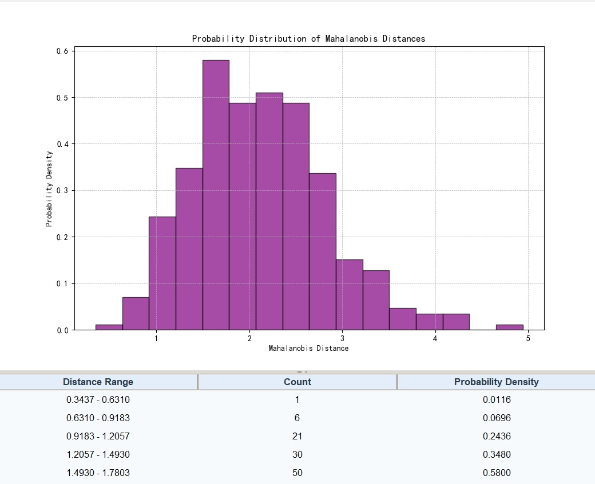
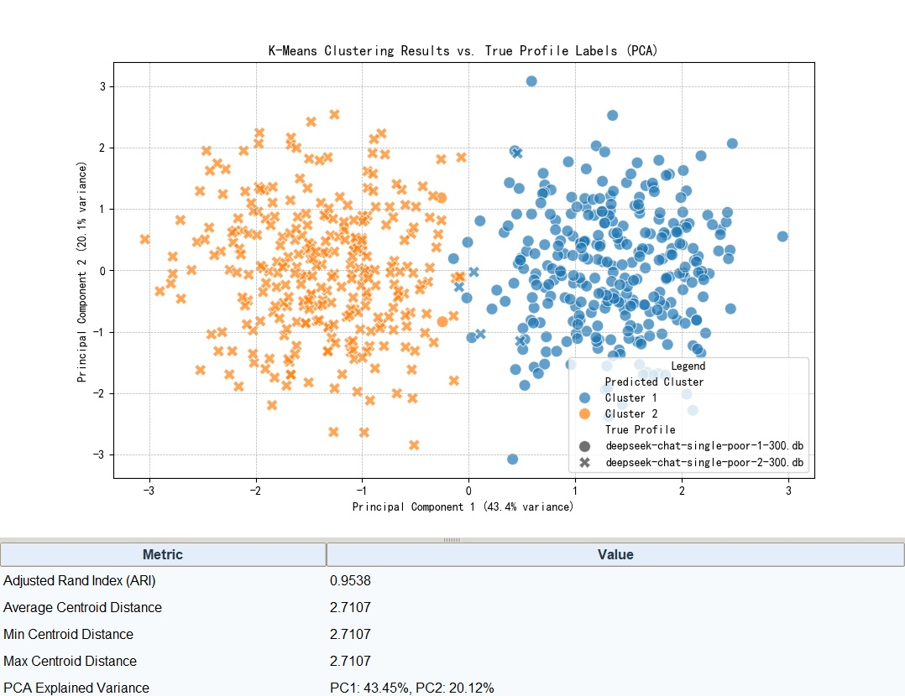
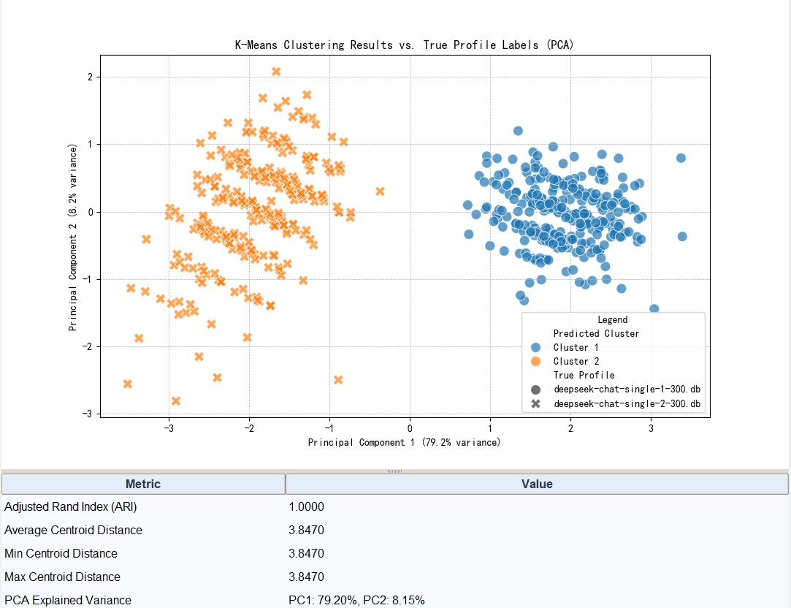
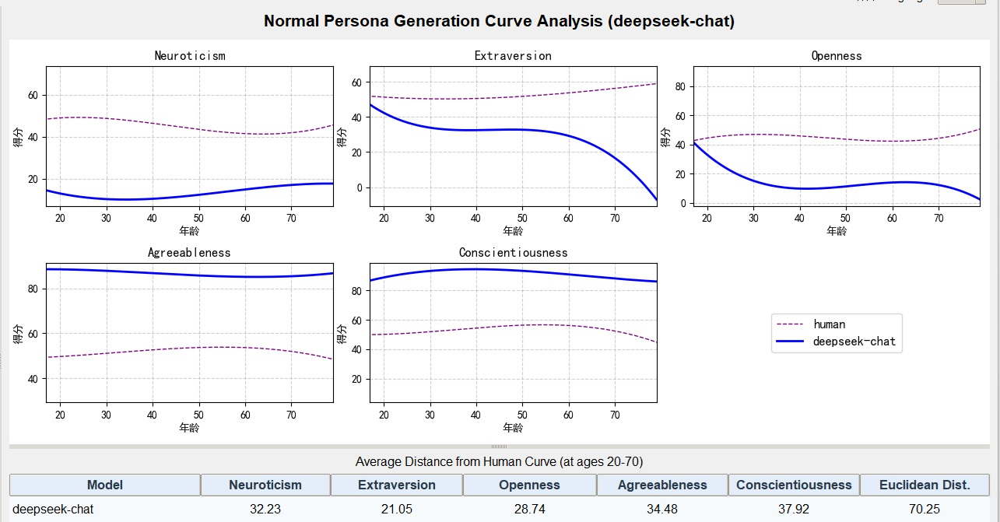
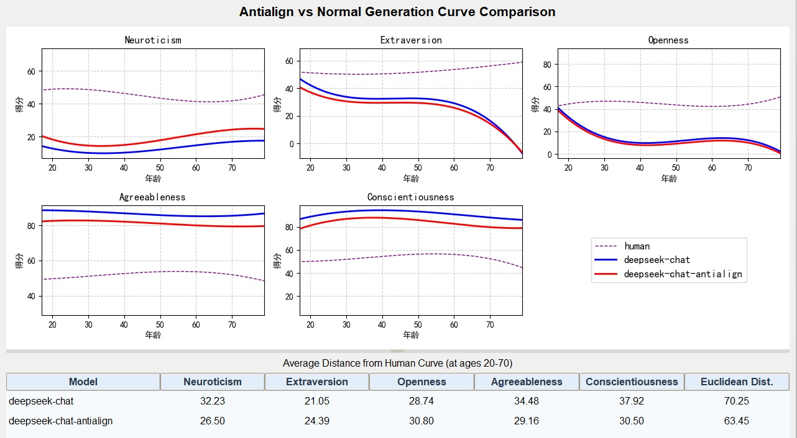
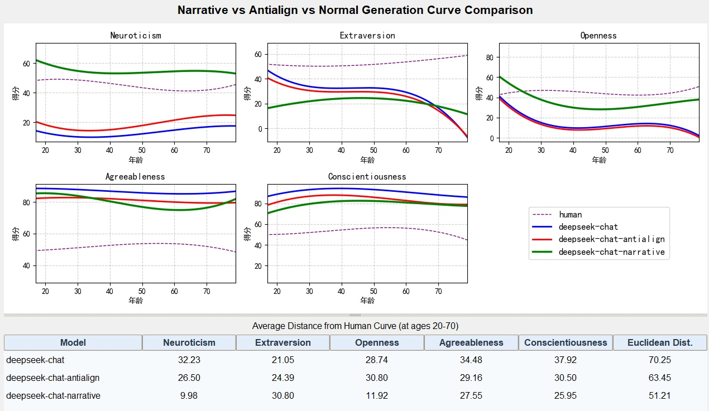
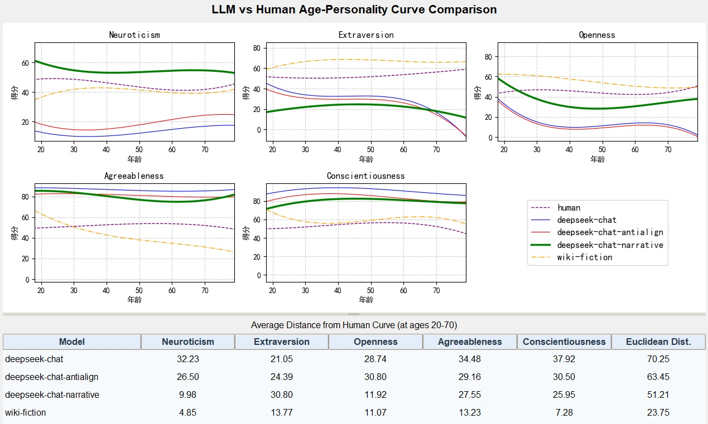

# 1. 项目简介

本仓库支持将语言模型智能体应用于社会和经济学科研究，重点关注人格特质分析和模拟。

**实验数据下载：**  
链接:https://pan.baidu.com/s/1UH1aIz85ckASXlCRRzBmUA?pwd=1234 提取码:1234  
复制这段内容后打开百度网盘手机App，操作更方便哦

# 2. 系统架构与实现

## 2.1 软件架构

系统由三个主要组件组成：
1. **asociety包**：人物画像生成和人格评估的核心引擎组件
2. **studio包**：用于小规模实验和可视化的桌面工作室
3. **tools包**：用于大规模数据处理和分析的批处理作业脚本

## 2.2 流水线架构

流水线包含两个主要阶段：

### 2.2.1 阶段1：人物画像准备流水线

**数据来源：**
- **人口普查数据采样**：主要方法，使用`data/census.csv`中的人口统计数据
- **外部样本导入**：替代方法，使用外部数据库的预生成样本

**人物画像生成过程：**
1. **骨架生成** (`tools/pipeline/create_persona_sample.py`)
   - 从人口普查数据中采样人口统计属性
   - 创建包含年龄、性别、职业、教育等基本信息的人物骨架
   - 支持基于人口分布的加权随机采样

2. **人物画像丰富** (`tools/pipeline/generate_persona.py`)
   - 使用LLM丰富骨架数据的详细描述
   - 结合多个人物画像方面（专业、体育、艺术、旅行、烹饪）
   - 为人格测试生成全面的人物画像描述

3. **数据库集成**
   - 将骨架存储在`samples`表中
   - 将丰富后的人物画像存储在`persona`表中，包含组合描述
   - 维护骨架和丰富人物画像之间的UUID映射

### 2.2.2 阶段2：人格测试流水线

**流水线概述：**
人格测试流水线在单个数据库文件上运行，产生完整的实验数据集。每次流水线执行代表一个设计的实验，该实验：
- 通过配置的测试方法处理人物画像
- 生成全面的响应数据
- 产生分析后的人格配置文件
- 完成后，实验数据库通常手动复制到`data/db/backup/`目录进行后续统计分析
- 备份数据库按实验类型和配置在备份目录中有序组织

**抽象测试过程：**
无论使用何种方法，流水线都遵循一致的工作流程：
1. **初始化**：设置答案跟踪结构（通常数据库结构已预配置）
2. **执行**：向人物画像管理人格问卷
3. **提取**：处理响应以提取人格特质分数
4. **存储**：将计算的人格配置文件保存到数据库

**配置控制方法：**
系统支持两种IPIP-NEO-120问卷管理测试方法：

**方法1：基于问题的测试** (`request_method = "question"`)
- **方法**：单独问题回答，使用单独的LLM调用（每人120次API调用）
- **数据结构**：`question_answer`表，模式为`(persona_id, question_id, response)`
- **处理**：通过`qa_service.py`顺序处理问题
- **提示**：使用`question_prompt`模板

**方法2：测验/表格测试** (`request_method = "sheet"`)
- **方法**：IPIP-NEO-120问卷分为6个表格，每个20个问题（每人6次API调用）
- **目的**：与120次单独调用相比显著减少LLM资源消耗
- **效率**：将API调用从每人120次减少到6次（减少20倍）
- **数据结构**：`quiz_answer`表，包含JSON响应，包含每个20问题表格的答案
- **处理**：通过`quiz_service.py`批量表格处理
- **提示**：使用`sheet_prompt`模板，具有结构化JSON输出格式

**主要动机：**
测验/表格方法专门为高效的大规模IPIP-NEO-120数据收集设计，显著降低LLM API成本和处理时间，同时保持数据质量。

**统一提取：**
两种方法汇聚到共同的提取过程：
- **提取模块**：`answer_extractor.py`
- **统一接口**：`get_answers(persona_id)`函数自动检测方法
- **数据规范化**：将两种格式转换为标准化人格特质分数

**配置详情：**
- **控制键**：`config.json`中的`request_method`
- **有效值**：`"question"`或`"sheet"`
- **自动提示选择**：基于方法和`question_prompt`配置值

**关键实现脚本：**
- `pipeline.py`：基于`request_method`条件分支的主协调器
- `qa_service.py`：基于问题的答案收集和处理
- `quiz_service.py`：基于表格的问卷任务管理
- `answer_extractor.py`：两种方法的统一答案处理

## 2.3 数据结构

数据存储在SQLite数据库(`data/db/agent-society.db`)中，包含：
- `persona`：具有人口统计属性的丰富人物画像描述
- `samples`：LLM丰富前的原始骨架数据
- `question_answer`：单独问题响应
- `quiz_answer`：完整问卷响应
- `personality`：提取的人格特质分数

## 2.4 工作流程

完整的研究工作流程：
1. **人物画像骨架生成**：从人口普查数据中人口统计采样
2. **人物画像丰富**：基于LLM的描述生成
3. **人格测试**：IPIP-NEO问卷管理
4. **数据备份**：实验数据库复制到`data/db/backup/`进行保存
5. **统计分析**：使用备份数据进行特质提取和验证

## 2.5 安装

```bash
poetry install
```

## 2.6 说明

- 人口普查数据位于data/census.csv
- IPIP-NEO数据位于data/IPIP-NEO
- 提示词位于prompts目录
- asociety是引擎部分，tools包含UI和工具脚本，包括问题集导入。问题集JSONL文件位于data/test，使用工具导入到SQLite

# 3. 实验设计

## 3.1 个体水平实验

### 3.1.1 虚拟人物人格稳定性（收敛性）实验

**研究目标：**
测试和验证LLM角色扮演虚拟人物是否具有稳定和收敛的人格特质。

**实验方法：**
1. **基本方法**：对单个角色配置文件进行300次连续人格测试，验证虚拟人物在LLM角色扮演中是否表现出稳定和收敛的人格特质
2. **细节水平比较**：对不同细节水平的人物画像进行相同的人格测试，观察人格紧致性和稳定性的差异

**收敛性分析结果：**

*图：马氏距离分析显示300次测试中人格特质的收敛性 - 第一部分*


*图：马氏距离分析显示300次测试中人格特质的收敛性 - 第二部分*

### 3.1.2 LLM人物画像可识别性测试

**研究目标：**
测试LLM生成的人物画像人格配置文件的可识别性和独特性。

**实验方法：**
1. **基本方法**：对两个不同的人物画像各进行300次人格测试，混合结果后进行聚类分析，评估人物画像人格的可识别性
2. **细节水平影响**：对不同细节水平的人物画像进行相同实验，观察细节水平对可识别性的影响

**实验结果位置：**
- 个体水平实验结果存储在`data/db/backup/poor300`和`data/db/backup/samples300`目录

**示例结果：**

*图：低细节人物画像的聚类分析，显示不同的人格聚类*

  
*图：正常细节人物画像的聚类分析，展示改进的可识别性*

## 3.2 群体水平实验

**研究目标：**
文献表明五大性格特质在年龄维度具有不变性。本实验比较LLM生成的人物画像人格测试在年龄维度的统计与真实人类的统计，观察LLM人物画像在性格方面、在群体水平模拟人类群体的能力。

**实验设计：**
- 比较LLM生成人物和真实人类在不同年龄组的人格特质统计分布
- 分析LLM人物是否保持与人类心理学研究中观察到的人格特质不变性模式
- 评估LLM群体水平人格模拟与真实人类人口数据的保真度

### 3.2.1 LLM生成画像人格一致性测试

**研究目标：**
对通过人口数据插值并用LLM丰富细节所得的600个人物画像进行性格测试，然后对其结果进行年龄轴统计，与真实人类统计进行比较。

**实验设计：**
- 通过人口数据插值和LLM基础细节丰富生成600个人物画像
- 对所有生成画像进行全面人格测试
- 对人格测试结果进行年龄维度统计分析
- 将年龄轴统计模式与真实人类人口统计进行比较
- 评估LLM生成群体人格分布与真实人类人口模式的一致性和保真度

**结果：**

*图：正常LLM生成（蓝色）与人类基线（紫色）的比较，显示初始人格曲线模式*

### 3.2.2 使用提示词工程减轻LLM人物画像人格测试偏差

**研究目标：**
解决实验3.2.1中发现的LLM人物画像人格测试统计相对于人类数据的显著偏差，这种偏差由于对齐训练中使得LLM偏向正面表达的结果。使用提示词工程鼓励更真实和现实的响应。

**实验设计：**
- 利用反对齐提示词模板(`question_prompt_antialign`和`sheet_prompt_antialign`)，明确指示模型提供诚实、自然的响应
- 包含诸如"不要试图显得完美、过于积极或理想化。只需选择真正感觉最像你的选项，即使是中性或负面的"等指令
- 比较使用标准提示词与反对齐提示词的人格测试结果，测量偏差减少程度
- 评估提示词工程在产生更现实人格配置文件方面的有效性，这些配置文件更好地匹配人类统计模式

**提示词配置：**
- `prompts/experiment.json`中可用的反对齐提示词模板：
  - `question_prompt_antialign`：用于基于问题的测试方法
  - `sheet_prompt_antialign`：用于基于表格的测试方法
- 配置键：`config.json`中的`question_prompt`可设置为使用反对齐变体

**结果：**

*图：抗对齐方法（红色）与人类基线的比较，展示偏见减少效果*

### 3.2.3 现实主义人物生成的小说写作方法

**研究目标：**
让LLM在生成人物画像时写小说，设计动机是：强烈提示其尊重现实生活的酸甜苦辣，悲欢离合，而能更大程度上接近真实人类。

**实验设计：**
- 使用基于叙事的提示词模板，将人物生成框架为小说写作
- 使用`from_skeleton_narrative`提示，将LLM定位为创作原创故事的成就小说家
- 使用`sheet_prompt_narrative`进行人格测试，将人物视为具有生活经历的小说主角
- 方法强调："这不是简单的人物素描——将配置文件视为有生活、有叙述的人物，具有记忆、目标、恐惧、关系、声音和一致的内在生活"
- 比较通过小说写作方法生成的人物与标准生成方法的现实主义和深度

**提示词配置：**
- **人物生成**：`prompts/generation.json`中的`from_skeleton_narrative`
- **人格测试**：`prompts/experiment.json`中的`sheet_prompt_narrative`
- **配置**：在`config.json`中将`persona_prompt`设置为`from_skeleton_narrative`，将`question_prompt`设置为`sheet_prompt_narrative`

**关键特性：**
- 需要具有开头、发展、高潮和结局的连贯情节
- 包含人物适当的特质、观点和心理状态
- 包括生动的环境描述和引人入胜的对话
- 最少2000字以确保深度和复杂性
- 产生具有现实生活经历和情感深度的人物

**结果：**
  
*图：叙事方法（绿色）显示改进的对人类人格曲线的逼近*

**可识别性强化分析：**

*图：叙事方法人物的聚类分析，显示增强的人格独特性*

*注：此聚类分析是在完成叙事方法实验后，为进一步验证可识别性而进行的补充分析。结果显示叙事方法生成的人物具有更强的可识别性和独特性，进一步支持了该方法的有效性。*

### 3.2.4 Wikidata文学作品人物人格测试

**研究目标：**
继实验3.2.3中观察到显著改进（大幅接近人类曲线）后，我们尝试使用人类创作者作品中的人物形象作为人物画像驱动LLM任务扮演进行性格测试，验证LLM虚拟人物性格测试随着人物画像细节度、真实度的增强是否进一步逼近人类曲线。

**实验设计：**
- 从Wikidata提取文学作品人物的人物画像
- 使用专门为Wikidata虚构人物设计的`sheet_prompt_wikifiction`提示词模板
- 对这些人类创作的文学人物进行人格测试
- 将结果人格分布与以下进行比较：
  1. 标准LLM生成人物（基线）
  2. 小说写作方法人物（3.2.3）
  3. 真实人类人口统计
- 分析随着人物画像真实性增加，曲线逼近的进展

**提示词配置：**
- **测试提示**：`prompts/experiment.json`中的`sheet_prompt_wikifiction`
- **人物来源**：Wikidata提取的虚构人物画像
- **关键特性**：
  - 专门为Wikidata来源的虚构人物设计
  - 强调在描述设置边界内的上下文推断
  - 保持与原始文学背景的人物一致性
  - 为人格测试选择提供角色内理由

**预期结果：**
验证LLM虚拟人物人格测试随着人物画像细节水平和真实性的增加，表现出逐步逼近人类统计曲线的进展，人类创作的文学人物代表最高水平的人物画像真实性。

**结果：**

*图：维基数据文学人物（橙色）与人类基线的比较，显示最高水平的真实性*

**综合曲线比较结果：**
*注：各个实验的具体结果请参见上面相应的实验部分。*

## 3.3 实验数据备份结构

实验结果根据实验设计在`data/db/backup/`目录中有系统地组织：

### 3.3.1 个体水平实验数据（第3.1节）

**poor300/目录 - 虚拟人物人格稳定性测试（实验3.1.1）：**
- `deepseek-chat-single-poor-1-300.db`：对第一个低细节人物配置文件的300次连续人格测试
- `deepseek-chat-single-poor-2-300.db`：对第二个低细节人物配置文件的300次连续人格测试

**samples300/目录 - 人物可识别性测试（实验3.1.2）：**
- `deepseek-chat-single-1-300.db`：对第一个人物配置文件的300次测试，用于可识别性分析
- `deepseek-chat-single-2-300.db`：对第二个人物配置文件的300次测试，用于可识别性分析

### 3.3.2 群体水平实验数据（第3.2节）

**主要数据库文件：**
- `deepseek-chat-narrative.db`：小说写作方法结果（实验3.2.3）
- `deepseek-chat-antialign.db`：反对齐提示词结果（实验3.2.2）
- `human.db`：用于比较基线的真实人类统计（实验3.2.1、3.2.4）
- `deepseek-chat.db`：标准LLM生成人物基线

**附加实验目录：**
- `samples-narrative300/`：用于详细分析的叙事方法人物结果
- `nvidia300/`：附加实验变体
- `wiki/`：Wikidata文学人物实验数据（实验3.2.4）

### 3.3.3 数据库命名约定
实验数据库遵循模式：`{llm_model}-{experiment_type}-{configuration}.db`
- **llm_model**：deepseek-chat、glm-4-9b-chat等
- **experiment_type**：single、narrative、antialign、quiz等
- **configuration**：附加实验特定参数

### 3.3.4 数据保存工作流程
1. **实验执行**：流水线处理人物画像并在工作数据库中生成结果
2. **数据备份**：完成的实验数据库手动复制到`data/db/backup/`
3. **组织**：数据库按实验类型和配置组织
4. **分析**：备份数据库加载到Agentic-Society-Studio进行统计分析

# 4. Agentic-Society-Studio使用

## 4.1 概述

Agentic-Society-Studio是专门为已完成实验的人格测试结果可视化和统计分析设计的桌面应用程序。它提供了专门针对第3节描述的实验设计量身定制的分析工具。

## 4.2 分析工具类别

工作室提供两类主要分析工具：

1. **通用数据分析工具**：适用于任何数据源的通用统计工具
2. **专业化实验分析**：专门为第3节实验设计预配置的分析面板

工作室设计用于分析备份目录中存储的实验结果：

### 4.2.1 个体水平实验分析（3.1）
- **poor300/**：包含虚拟人物人格稳定性测试结果
  - `deepseek-chat-single-poor-1-300.db`：单个低细节人物的300次测试
  - `deepseek-chat-single-poor-2-300.db`：第二个低细节人物的300次测试
- **samples300/**：包含可识别性测试结果  
  - `deepseek-chat-single-1-300.db`：第一个人物配置文件的300次测试
  - `deepseek-chat-single-2-300.db`：第二个人物配置文件的300次测试

**工作室分析工具：**
- **稳定性分析面板**：分析300次重复测试的收敛性和稳定性
- **可识别性面板**：聚类分析以测量人物独特性
- **t-SNE可视化**：降维以可视化人物分离

### 4.2.2 群体水平实验分析（3.2）
- `deepseek-chat-narrative.db`：小说写作方法结果（3.2.3）
- `deepseek-chat-antialign.db`：反对齐提示词结果（3.2.2）  
- `human.db`：用于比较的真实人类统计（3.2.1、3.2.4）
- `samples-narrative300/`：叙事方法人物结果

**工作室分析工具：**
- **曲线比较面板**：比较不同实验的人格曲线
- **因素分析面板**：验证人格因素结构一致性
- **CFA面板**：模型验证的验证性因素分析

## 4.3 启动工作室

```bash
# 从项目根目录启动工作室应用程序
poetry run python -m studio.agent-society-studio
```

## 4.4 工具类别详情

### 4.4.1 通用数据分析工具
这些是"数据分析"菜单下可用的通用统计工具：
- **人格分析**：基本人格特质探索
- **马氏距离**：异常值检测和距离分析
- **聚类分析**：人格配置文件的无监督聚类
- **t-SNE可视化**：模式可视化的降维
- **配置文件比较**：多模式配置文件比较
- **内部一致性**：人格测量的可靠性分析
- **因素分析（EFA）**：探索性因素分析
- **验证性因素分析（CFA）**：模型验证分析

这些工具允许研究人员选择任何数据源并执行自定义分析。

### 4.4.2 专业化实验分析
这些是"专题分析"菜单下的预配置分析面板，专门为实验设计：
- **稳定性分析**：用于实验3.1.1 - 虚拟人物人格稳定性
- **可识别性分析**：用于实验3.1.2 - 人物配置文件独特性
- **曲线比较**：用于实验3.2.1-3.2.4 - 全面的年龄维度曲线分析
- **正常生成分析**：用于分析标准deepseek-chat人物画像生成曲线
- **抗对齐比较**：用于比较抗对齐与正常生成曲线
- **叙事比较**：用于全面比较叙事、抗对齐和正常生成

这些面板针对特定实验数据结构和研究问题进行了优化。

## 4.5 实验结果分析工作流程

1. **加载实验数据库**：根据实验类型从`data/db/backup/`选择
2. **选择分析面板**：选择适当的分析工具：
   - 对于稳定性测试：使用稳定性分析面板
   - 对于可识别性：使用可识别性和聚类面板  
   - 对于群体比较：使用曲线比较和CFA面板
3. **配置分析参数**：为每种实验类型设置特定参数
4. **执行和比较**：运行分析并比较不同实验条件的结果
5. **导出发现**：保存统计结果和可视化以供研究报告

## 4.6 关键分析能力

### 4.6.1 个体水平实验（3.1）
- **收敛分析**：测量300次测试中人格特质的稳定性
- **聚类分离**：量化人物配置文件之间的独特性
- **内部一致性**：评估人格测量的可靠性

### 4.6.2 群体水平实验（3.2）  
- **曲线逼近**：测量LLM曲线与人类统计的接近程度
- **偏差减少**：量化反对齐提示词的有效性
- **现实主义评估**：评估小说写作方法的改进
- **真实性梯度**：分析从标准→小说→人类创建人物的进展

## 4.7 支持的实验数据

- `data/db/backup/`中已完成实验的所有SQLite数据库
- 用于交叉验证的多个实验比较
- 与两种测试方法（基于问题和基于表格）的集成
- 支持不同的LLM配置和提示词变体

## 4.8 专业化曲线比较面板
工作室包含多个专业化曲线比较面板，用于分析不同年龄维度的人格特质曲线：

### 4.8.1 综合曲线比较面板
- **目的**：比较LLM生成人物与人类基线数据在所有deepseek变体之间的人格特质曲线
- **数据源**：人类基线 + deepseek-chat + deepseek-chat-antialign + deepseek-chat-narrative + wiki-fiction
- **特性**：每个人格特质的可视化曲线、距离指标、统计分析
- **分析**：在特定年龄点（20、30、40、50、60、70岁）计算欧几里得距离

### 4.8.2 正常生成分析面板
- **目的**：单独分析标准deepseek-chat人物画像生成曲线
- **数据源**：仅deepseek-chat（蓝色线条，线宽=2.0）
- **使用场景**：专注于正常人物生成模式的分析，无比较干扰

### 4.8.3 抗对齐比较面板
- **目的**：比较抗对齐与正常生成曲线
- **数据源**：deepseek-chat（蓝色） vs deepseek-chat-antialign（红色）
- **使用场景**：分析抗对齐提示词在减少LLM偏见方面的有效性

### 4.8.4 叙事比较面板
- **目的**：全面比较所有三个deepseek变体
- **数据源**：deepseek-chat（蓝色） + deepseek-chat-antialign（红色） + deepseek-chat-narrative（绿色）
- **使用场景**：全面分析不同生成策略及其对人格曲线的影响

### 4.8.5 关键分析指标
所有曲线比较面板提供：
- **可视化比较**：神经质、外向性、开放性、宜人性、尽责性在不同年龄组的图表
- **距离表**：与人类基线的平均特质差异和总体欧几里得距离
- **统计分析**：在特定年龄点计算平均特质差异
- **样式自定义**：不同的线条样式和颜色便于视觉区分

# 5. 工具使用指南

本节提供项目中各种命令行工具的示例和使用说明。

## 5.1 流水线工具

### 5.1.1 copy_random_samples.py
在数据库之间复制随机样本以进行实验设置。

**示例命令：**
```bash
# 从源数据库复制100个随机样本到目标数据库
poetry run python tools/pipeline/copy_random_samples.py --source_db data/db/source.db --dest_db data/db/experiment.db -n 100

# 验证数据库是否恰好包含100个样本
poetry run python tools/pipeline/copy_random_samples.py --verify --db_path data/db/experiment.db -n 100
```

### 5.1.2 create_persona_sample.py
从人口普查数据创建人物样本用于实验群体。

**示例命令：**
```bash
# 为群体实验创建600个人物样本
poetry run python tools/pipeline/create_persona_sample.py -n 600
```

### 5.1.3 generate_persona.py
使用LLM生成丰富的人物描述。

**示例命令：**
```bash
# 从样本骨架生成丰富的人物画像
poetry run python tools/pipeline/generate_persona.py
```

### 5.1.4 pipeline.py
人格测试实验的主流水线协调器。

**示例命令：**
```bash
# 运行完整的人格测试流水线
poetry run python tools/pipeline/pipeline.py
```

## 5.2 导入工具

### 5.2.1 import_ipip_set.py
将IPIP-NEO-120问题集导入数据库。

**示例命令：**
```bash
# 导入IPIP-NEO-120问卷
poetry run python tools/importers/import_ipip_set.py
```

### 5.2.2 import_human_data.py
导入人类人格数据用于比较研究。

**示例命令：**
```bash
# 导入人类参考数据
poetry run python tools/importers/import_human_data.py
```

### 5.2.3 import_wikidata_bios.py
从Wikidata导入人物传记用于文学人物实验。

**示例命令：**
```bash
# 导入Wikidata人物传记
poetry run python tools/importers/import_wikidata_bios.py
```

## 5.3 导出工具

### 5.3.1 export_personality_answers.py
导出人格答案数据用于外部分析。

**示例命令：**
```bash
# 将人格答案导出到CSV
poetry run python tools/exporters/export_personality_answers.py --output personality_data.csv
```

## 5.4 使用模式

### 实验设置工作流程：
```bash
# 1. 导入问卷数据
poetry run python tools/importers/import_ipip_set.py

# 2. 创建人物样本
poetry run python tools/pipeline/create_persona_sample.py -n 600

# 3. 生成丰富的人物画像
poetry run python tools/pipeline/generate_persona.py

# 4. 运行人格测试
poetry run python tools/pipeline/pipeline.py
```

### 数据管理工作流程：
```bash
# 为重点实验复制特定样本
poetry run python tools/pipeline/copy_random_samples.py --source_db data/db/backup/population.db --dest_db data/db/target_experiment.db -n 50

# 为外部分析导出结果
poetry run python tools/exporters/export_personality_answers.py --output experiment_results.csv
```

# 6. 贡献者
1. yuqi.bai