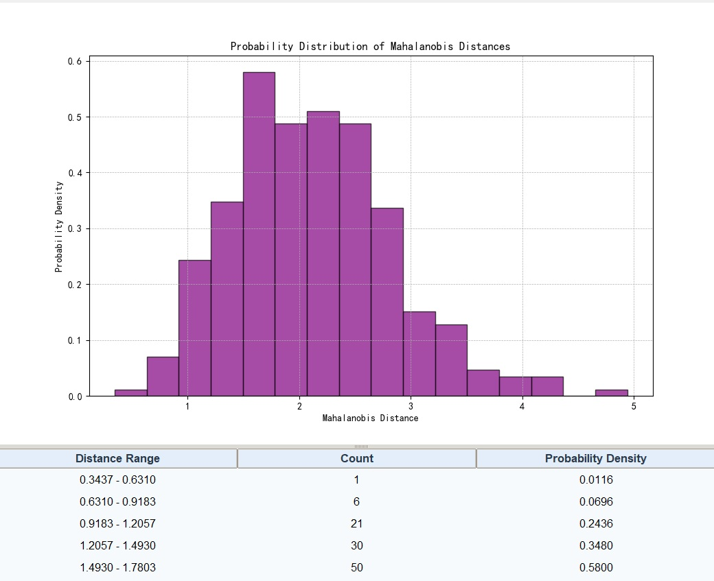
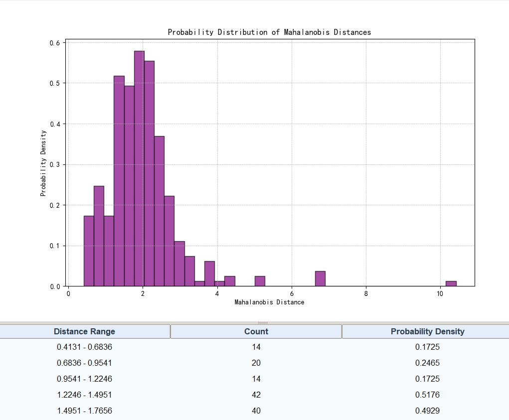
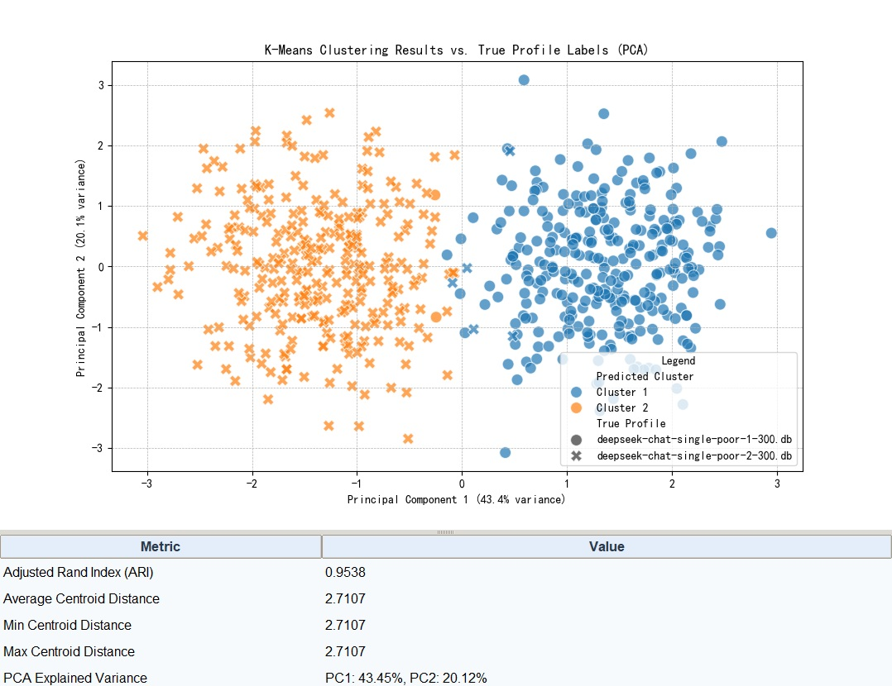
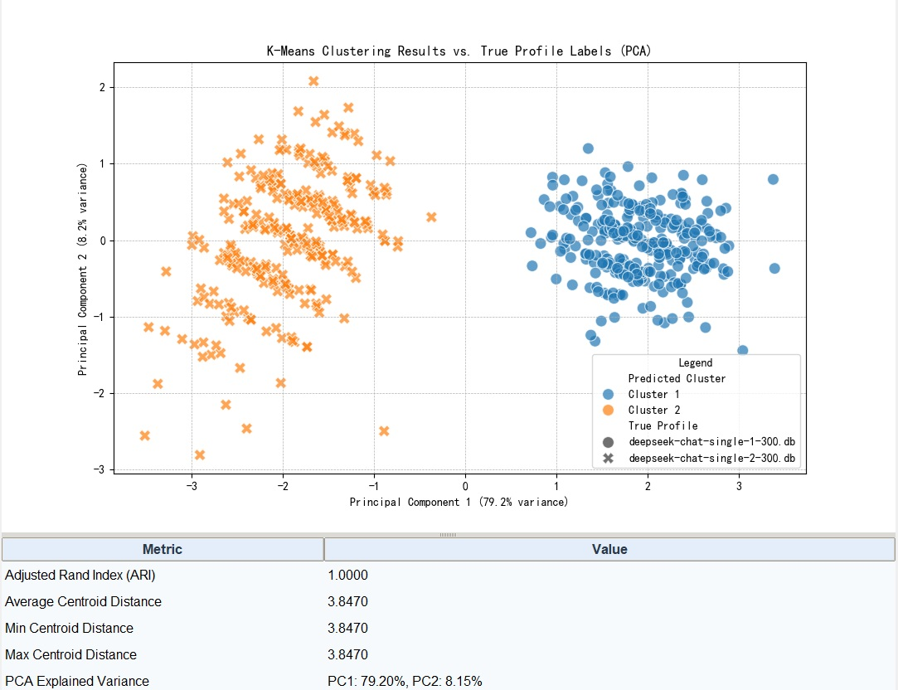
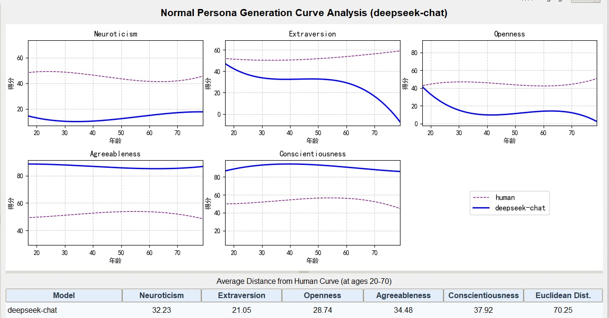
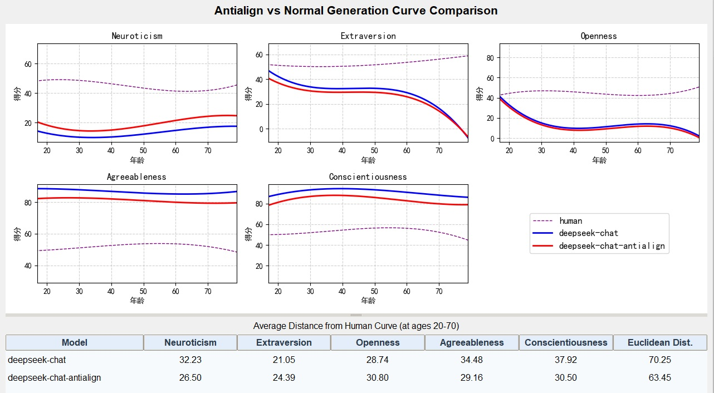
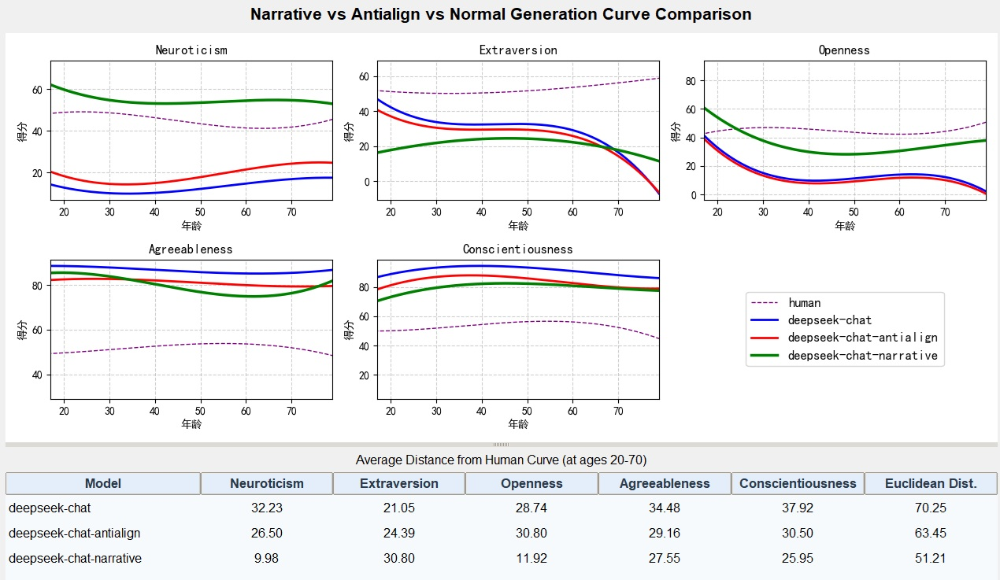
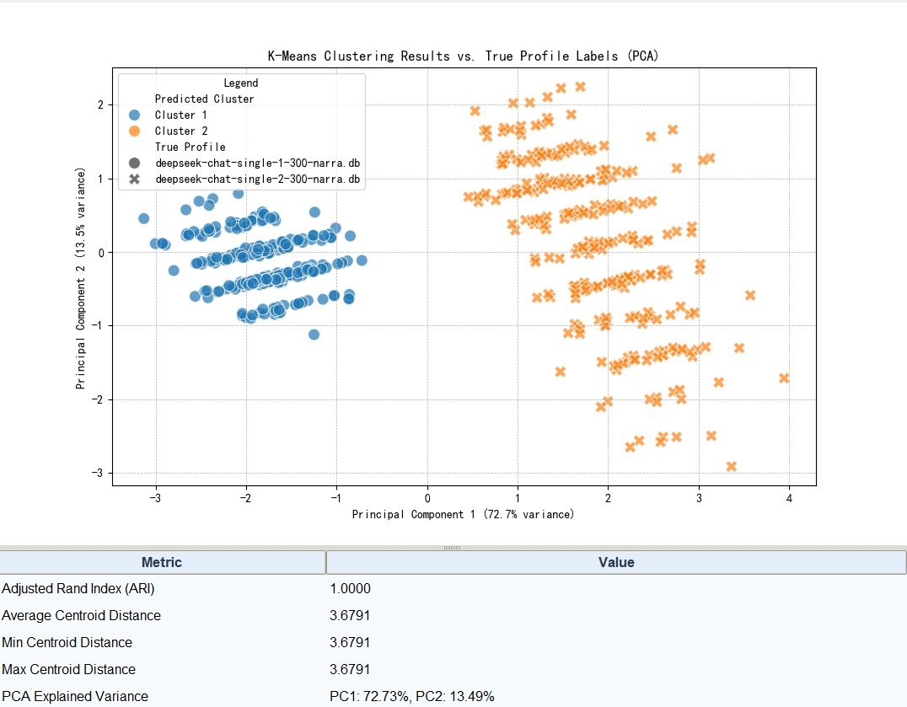
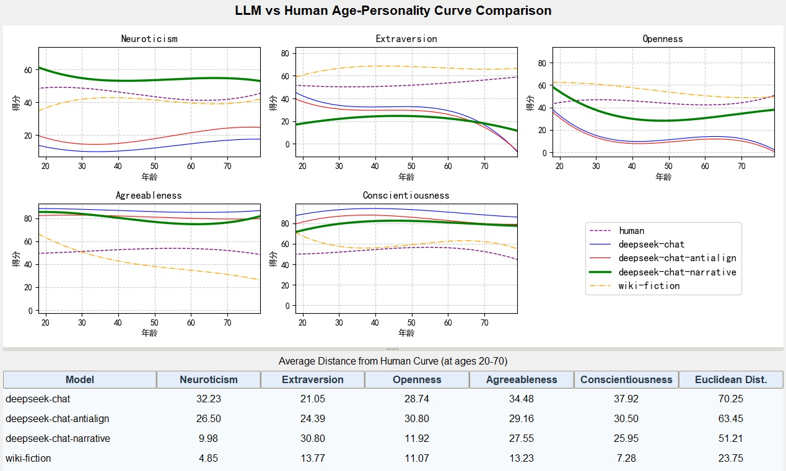

# 1. Description
This repository supports research in applying language model agents to social and economic studies, focusing on personality trait analysis and simulation.

# 2. System Architecture and Implementation

## 2.1 Software Architecture
The system consists of three main components:
1. **asociety package**: Core engine components for persona generation and personality assessment
2. **studio package**: Desktop studio for small-scale experiments and visualization
3. **tools package**: Batch job scripts for large-scale data processing and analysis

## 2.2 Pipeline Architecture

The pipeline consists of two main phases:

### 2.2.1 Phase 1: Persona Preparation Pipeline

**Data Sources:**
- **Census Data Sampling**: Primary method using demographic statistics from `data/census.csv`
- **External Sample Import**: Alternative method using pre-generated samples from external databases

**Persona Generation Process:**
1. **Skeleton Generation** (`tools/pipeline/create_persona_sample.py`)
   - Samples demographic attributes from census data
   - Creates basic persona skeletons with age, sex, occupation, education, etc.
   - Supports weighted random sampling based on population distributions

2. **Persona Enrichment** (`tools/pipeline/generate_persona.py`)
   - Uses LLMs to enrich skeleton data with detailed descriptions
   - Combines multiple persona aspects (professional, sports, arts, travel, culinary)
   - Generates comprehensive persona descriptions for personality testing

3. **Database Integration**
   - Stores skeletons in `samples` table
   - Stores enriched personas in `persona` table with combined descriptions
   - Maintains UUID mapping between skeletons and enriched personas

### 2.2.2 Phase 2: Personality Testing Pipeline

**Pipeline Overview:**
The personality testing pipeline operates on a single database file to produce a complete set of experimental data. Each pipeline execution represents a designed experiment that:
- Processes personas through the configured testing method
- Generates comprehensive response data
- Produces analyzed personality profiles
- Upon completion, the experimental database is typically manually copied to the `data/db/backup/` directory for subsequent statistical analysis
- Backup databases are organized by experiment type and configuration in the backup directory

**Abstract Testing Process:**
The pipeline follows a consistent workflow regardless of the method used:
1. **Initialization**: Set up answer tracking structures (normally database structures are pre-configured)
2. **Execution**: Administer personality questionnaires to personas
3. **Extraction**: Process responses to extract personality trait scores
4. **Storage**: Save computed personality profiles to database

**Configuration-Controlled Methods:**
The system supports two testing approaches for IPIP-NEO-120 questionnaire administration:

**Method 1: Question-based Testing** (`request_method = "question"`)
- **Approach**: Individual question answering with separate LLM calls (120 API calls per persona)
- **Data Structure**: `question_answer` table with `(persona_id, question_id, response)` schema
- **Processing**: Sequential question processing via `qa_service.py`
- **Prompt**: Uses `question_prompt` templates

**Method 2: Quiz/Sheet-based Testing** (`request_method = "sheet"`)
- **Approach**: IPIP-NEO-120 questionnaire divided into 6 sheets of 20 questions each (6 API calls per persona)
- **Purpose**: Significant reduction in LLM resource consumption compared to 120 individual calls
- **Efficiency**: Reduces API calls from 120 per persona to 6 per persona (20x reduction)
- **Data Structure**: `quiz_answer` table with JSON responses containing answers for each 20-question sheet
- **Processing**: Batch sheet processing via `quiz_service.py`
- **Prompt**: Uses `sheet_prompt` templates with structured JSON output formatting

**Primary Motivation**:
The Quiz/Sheet method is designed specifically for efficient large-scale IPIP-NEO-120 data collection, dramatically reducing LLM API costs and processing time while maintaining data quality.

**Unified Extraction:**
Both methods converge to a common extraction process:
- **Extraction Module**: `answer_extractor.py`
- **Unified Interface**: `get_answers(persona_id)` function automatically detects method
- **Data Normalization**: Converts both formats to standardized personality trait scores

**Configuration Details:**
- **Control Key**: `request_method` in `config.json`
- **Valid Values**: `"question"` or `"sheet"`
- **Automatic Prompt Selection**: Based on method and `question_prompt` config value

**Key Implementation Scripts:**
- `pipeline.py`: Main orchestrator with conditional branching based on `request_method`
- `qa_service.py`: Question-based answer collection and processing
- `quiz_service.py`: Sheet-based questionnaire task management
- `answer_extractor.py`: Unified answer processing for both methods

## 2.3 Data Structure
Data is stored in SQLite database (`data/db/agent-society.db`) with:
- `persona`: Enriched persona descriptions with demographic attributes
- `samples`: Original skeleton data before LLM enrichment
- `question_answer`: Individual question responses
- `quiz_answer`: Complete questionnaire responses
- `personality`: Extracted personality trait scores

## 2.4 Workflow
The complete research workflow:
1. **Persona Skeleton Generation**: Demographic sampling from census data
2. **Persona Enrichment**: LLM-based description generation
3. **Personality Testing**: IPIP-NEO questionnaire administration
4. **Data Backup**: Experimental databases copied to `data/db/backup/` for preservation
5. **Statistical Analysis**: Trait extraction and validation using backup data

## 2.5 Installation
```bash
poetry install
```

## 2.6 Instructions

- Census data is located in data/census.csv
- IPIP-NEO data is located in data/IPIP-NEO
- Prompts are located in prompts
- asociety is the engine part, while tools contains UI and tool scripts, including question set imports. The question set JSONL files are in data/test and are imported into SQLite using the tools.

# 3. Experimental Design

## 3.1 Individual-Level Experiments

### 3.1.1 Virtual Character Personality Stability (Convergence) Experiment

**Research Objective:**
Test and validate whether LLM role-playing virtual characters possess stable and convergent personality traits.

**Experimental Methods:**
1. **Basic Method**: Conduct 300 consecutive personality tests on a single character profile to verify if virtual characters exhibit stable and convergent personality traits in LLM role-playing
2. **Detail Level Comparison**: Perform the same personality testing on character profiles with different levels of detail to observe differences in personality compactness and stability

**Convergence Analysis Results:**

*Figure: Mahalanobis distance analysis showing personality trait convergence over 300 tests - Part 1*


*Figure: Mahalanobis distance analysis showing personality trait convergence over 300 tests - Part 2*

### 3.1.2 LLM Character Profile Identifiability Test

**Research Objective:**
Test the identifiability and distinctiveness of LLM-generated character personality profiles.

**Experimental Methods:**
1. **Basic Method**: Conduct 300 personality tests each on two different character profiles, mix the results, and perform clustering analysis to evaluate the identifiability of character personality profiles
2. **Detail Level Impact**: Conduct the same experiment with character profiles of different detail levels to observe the impact of detail level on identifiability

**Experimental Results Location:**
- Individual-level experiment results are stored in `data/db/backup/poor300` and `data/db/backup/samples300` directories

**Example Results:**

*Figure: Clustering analysis of poor-detail character profiles showing distinct personality clusters*

  
*Figure: Clustering analysis of normal-detail character profiles demonstrating improved identifiability*

## 3.2 Population-Level Experiments

**Research Objective:**
Literature indicates that the Big Five personality traits exhibit invariance across age dimensions. This experiment compares LLM-generated character personality test statistics across age dimensions with real human statistics to observe LLM characters' ability to simulate human populations at the group level in terms of personality.

**Experimental Design:**
- Compare statistical distributions of personality traits across different age groups between LLM-generated characters and real human populations
- Analyze whether LLM characters maintain the same personality trait invariance patterns as observed in human psychological research
- Evaluate the fidelity of LLM population-level personality simulation compared to real human demographic data

### 3.2.1 LLM Generated Profile Personality Consistency Test

**Research Objective:**
Conduct personality testing on 600 character profiles obtained by interpolating population data and enriching details with LLM, then perform age-axis statistical analysis on the results and compare with real human statistics.

**Experimental Design:**
- Generate 600 character profiles through population data interpolation and LLM-based detail enrichment
- Conduct comprehensive personality testing on all generated profiles
- Perform statistical analysis along the age dimension of the personality test results
- Compare the age-axis statistical patterns with real human population statistics
- Evaluate the consistency and fidelity of LLM-generated population personality distributions compared to real human demographic patterns

**Results:**

*Figure: Comparison of normal LLM generation (blue) with human baseline (purple) showing initial personality curve patterns*

### 3.2.2 Mitigating LLM Persona Personality Test Bias with Prompt Engineering

**Research Objective:**
Address the significant bias discovered in Experiment 3.2.1 where LLM character personality test statistics showed large deviations from human data due to alignment training that makes LLMs偏向正面表达. Use prompt engineering to encourage more authentic and realistic responses.

**Experimental Design:**
- Utilize anti-alignment prompt templates (`question_prompt_antialign` and `sheet_prompt_antialign`) that explicitly instruct the model to provide honest, natural responses
- Incorporate instructions such as: "Do not try to appear perfect, overly positive, or idealized. Just choose the option that truly feels most like you, even if it is neutral or negative."
- Compare personality test results using standard prompts vs. anti-alignment prompts to measure bias reduction
- Evaluate the effectiveness of prompt engineering in producing more realistic personality profiles that better match human statistical patterns

**Prompt Configuration:**
- Available anti-alignment prompt templates in `prompts/experiment.json`:
  - `question_prompt_antialign`: For question-based testing method
  - `sheet_prompt_antialign`: For sheet-based testing method
- Configuration key: `question_prompt` in `config.json` can be set to use anti-alignment variants

**Results:**

*Figure: Anti-alignment approach (red) comparison with human baseline demonstrating bias reduction*

### 3.2.3 Novel Writing Approach for Realistic Character Generation

**Research Objective:**
Have LLM write novels when generating character profiles, with the design motivation to strongly prompt it to respect the complexities of real life (bitterness and sweetness, joys and sorrows, partings and reunions), thereby achieving a greater degree of proximity to real humans.

**Experimental Design:**
- Use narrative-based prompt templates that frame character generation as novel writing
- Employ `from_skeleton_narrative` prompt that positions the LLM as an accomplished novelist creating original stories
- Utilize `sheet_prompt_narrative` for personality testing that treats characters as novel protagonists with lived experiences
- The approach emphasizes: "This is not a simple persona sketch — treat the profile as a lived, narrated character with memories, goals, fears, relationships, voice, and a consistent inner life"
- Compare the realism and depth of characters generated through novel writing approach vs. standard generation methods

**Prompt Configuration:**
- **Character Generation**: `from_skeleton_narrative` in `prompts/generation.json`
- **Personality Testing**: `sheet_prompt_narrative` in `prompts/experiment.json`
- Configuration: Set `persona_prompt` to `from_skeleton_narrative` and `question_prompt` to `sheet_prompt_narrative` in `config.json`

**Key Features:**
- Requires coherent plot with beginning, development, climax, and resolution
- Incorporates character-appropriate traits, perspectives, and psychological states
- Includes vivid environmental descriptions and engaging dialogues
- Minimum 2,000 words to ensure depth and complexity
- Produces characters with realistic life experiences and emotional depth

**Results:**
  
*Figure: Narrative approach (green) showing improved approximation to human personality curves*

**Identifiability Reinforcement Analysis:**

*Figure: Clustering analysis of narrative approach characters showing enhanced personality distinctiveness*

*Note: This clustering analysis was conducted as a supplementary validation after completing the narrative method experiment to further verify identifiability. The results show that characters generated using the narrative method exhibit stronger identifiability and distinctiveness, providing additional support for the effectiveness of this approach.*

### 3.2.4 Wikidata Literary Character Personality Testing

**Research Objective:**
Following the significant improvement observed in Experiment 3.2.3 (substantially closer to human curves), we attempt to use character images from human creators' literary works as persona profiles to drive LLM role-playing for personality testing. Verify whether LLM virtual character personality testing further approaches human curves as the detail level and authenticity of character profiles increase.

**Experimental Design:**
- Extract character profiles from Wikidata for literary works characters
- Use `sheet_prompt_wikifiction` prompt template specifically designed for fictional characters from Wikidata
- Conduct personality testing on these human-created literary characters
- Compare the resulting personality distributions with:
  1. Standard LLM-generated characters (baseline)
  2. Novel-writing approach characters (3.2.3)
  3. Real human population statistics
- Analyze the progression of curve approximation as character profile authenticity increases

**Prompt Configuration:**
- **Testing Prompt**: `sheet_prompt_wikifiction` in `prompts/experiment.json`
- **Character Source**: Wikidata-extracted fictional character profiles
- **Key Features**: 
  - Specifically designed for Wikidata-sourced fictional characters
  - Emphasizes contextual extrapolation within described setting boundaries
  - Maintains character consistency with original literary context
  - Provides in-character rationales for personality test choices

**Expected Outcome:**
Validation that LLM virtual character personality testing demonstrates progressive approximation to human statistical curves as character profile detail level and authenticity increase, with human-created literary characters representing the highest level of profile authenticity.

**Results:**

*Figure: Wikidata literary characters (orange) comparison with human baseline showing highest level of authenticity*

**Comprehensive Curve Comparison Results:**
*Note: Individual experiment results are shown in their respective experimental sections above.*

## 3.3 Experimental Data Backup Structure

The experimental results are systematically organized in the `data/db/backup/` directory according to experimental designs:

**Experimental Data Download:**  
链接:https://pan.baidu.com/s/1UH1aIz85ckASXlCRRzBmUA?pwd=1234 提取码:1234  
复制这段内容后打开百度网盘手机App，操作更方便哦

### 3.3.1 Individual-Level Experiment Data (Section 3.1)

**poor300/ Directory - Virtual Character Personality Stability Tests (Experiment 3.1.1):**
- `deepseek-chat-single-poor-1-300.db`: 300 consecutive personality tests on first poor-detail character profile
- `deepseek-chat-single-poor-2-300.db`: 300 consecutive personality tests on second poor-detail character profile

**samples300/ Directory - Character Identifiability Tests (Experiment 3.1.2):**
- `deepseek-chat-single-1-300.db`: 300 tests on first character profile for identifiability analysis
- `deepseek-chat-single-2-300.db`: 300 tests on second character profile for identifiability analysis

### 3.3.2 Population-Level Experiment Data (Section 3.2)

**Main Database Files:**
- `deepseek-chat-narrative.db`: Novel-writing approach results (Experiment 3.2.3)
- `deepseek-chat-antialign.db`: Anti-alignment prompt results (Experiment 3.2.2)
- `human.db`: Real human statistics for comparison baseline (Experiments 3.2.1, 3.2.4)
- `deepseek-chat.db`: Standard LLM-generated character baseline

**Additional Experimental Directories:**
- `samples-narrative300/`: Narrative approach character results for detailed analysis
- `nvidia300/`: Additional experimental variations
- `wiki/`: Wikidata literary character experiment data (Experiment 3.2.4)

### 3.3.3 Database Naming Convention
Experimental databases follow the pattern: `{llm_model}-{experiment_type}-{configuration}.db`
- **llm_model**: deepseek-chat, glm-4-9b-chat, etc.
- **experiment_type**: single, narrative, antialign, quiz, etc.
- **configuration**: Additional experiment-specific parameters

### 3.3.4 Data Preservation Workflow
1. **Experiment Execution**: Pipeline processes personas and generates results in working database
2. **Data Backup**: Completed experimental databases are manually copied to `data/db/backup/`
3. **Organization**: Databases are organized by experiment type and configuration
4. **Analysis**: Backup databases are loaded into Agentic-Society-Studio for statistical analysis

# 4. Agentic-Society-Studio Usage

## 4.1 Overview
Agentic-Society-Studio is a desktop application specifically designed for visualization and statistical analysis of personality test results from completed experiments. It provides specialized analysis tools tailored to the experimental designs described in Section 3.

## 4.2 Analysis Tool Categories

The studio provides two main categories of analysis tools:

1. **General Data Analysis Tools**: Universal statistical tools that work with any data source
2. **Specialized Experimental Analysis**: Pre-configured analysis panels specifically designed for the experimental designs in Section 3

The studio is designed to analyze experimental results stored in the backup directory:

### 4.2.1 Individual-Level Experiment Analysis (3.1)
- **poor300/**: Contains results from virtual character personality stability tests
  - `deepseek-chat-single-poor-1-300.db`: 300 tests on single poor-detail character
  - `deepseek-chat-single-poor-2-300.db`: 300 tests on second poor-detail character
- **samples300/**: Contains identifiability test results  
  - `deepseek-chat-single-1-300.db`: 300 tests on first character profile
  - `deepseek-chat-single-2-300.db`: 300 tests on second character profile

**Studio Analysis Tools:**
- **Stability Analysis Panel**: Analyze convergence and stability of 300 repeated tests
- **Identifiability Panel**: Cluster analysis to measure character distinctiveness
- **t-SNE Visualization**: Dimensional reduction to visualize character separation

### 4.2.2 Population-Level Experiment Analysis (3.2)
- **deepseek-chat-narrative.db**: Novel-writing approach results (3.2.3)
- **deepseek-chat-antialign.db**: Anti-alignment prompt results (3.2.2)  
- **human.db**: Real human statistics for comparison (3.2.1, 3.2.4)
- **samples-narrative300/**: Narrative approach character results

**Studio Analysis Tools:**
- **Curve Comparison Panel**: Compare personality curves across different experiments
- **Factor Analysis Panel**: Validate personality factor structure consistency
- **CFA Panel**: Confirmatory factor analysis for model validation

## 4.3 Launching the Studio
```bash
# Launch the studio application from the project root directory
poetry run python -m studio.agent-society-studio
```

## 4.4 Tool Category Details

### 4.4.1 General Data Analysis Tools
These are universal statistical tools available under the "Data Analysis" menu:
- **Personality Analysis**: Basic personality trait exploration
- **Mahalanobis Distance**: Outlier detection and distance analysis
- **Clustering Analysis**: Unsupervised clustering of personality profiles
- **t-SNE Visualization**: Dimensionality reduction for pattern visualization
- **Profile Comparison**: Multi-mode profile comparison
- **Internal Consistency**: Reliability analysis of personality measurements
- **Factor Analysis (EFA)**: Exploratory factor analysis
- **Confirmatory Factor Analysis (CFA)**: Model validation analysis

These tools allow researchers to select any data source and perform custom analyses.

### 4.4.2 Specialized Experimental Analysis
These are pre-configured analysis panels under the "Special Analysis" menu, specifically designed for the experimental designs:
- **Stability Analysis**: For Experiment 3.1.1 - Virtual character personality stability
- **Identifiability Analysis**: For Experiment 3.1.2 - Character profile distinctiveness
- **Curve Comparison**: For Experiments 3.2.1-3.2.4 - Comprehensive age dimension curve analysis
- **Normal Generation Analysis**: For analyzing standard deepseek-chat persona generation curves
- **Antialign Comparison**: For comparing anti-alignment vs normal generation curves
- **Narrative Comparison**: For comprehensive comparison of narrative vs antialign vs normal generation

These panels are optimized for the specific experimental data structures and research questions.

## 4.5 Analysis Workflow for Experimental Results

1. **Load Experimental Database**: Select from `data/db/backup/` based on experiment type
2. **Select Analysis Panel**: Choose the appropriate analysis tool:
   - For stability tests: Use Stability Analysis Panel
   - For identifiability: Use Identifiability and Clustering Panels  
   - For population comparisons: Use Curve Comparison and CFA Panels
3. **Configure Analysis Parameters**: Set specific parameters for each experiment type
4. **Execute and Compare**: Run analyses and compare results across different experimental conditions
5. **Export Findings**: Save statistical results and visualizations for research reporting

## 4.6 Key Analysis Capabilities

### 4.6.1 For Individual-Level Experiments (3.1)
- **Convergence Analysis**: Measure personality trait stability over 300 tests
- **Cluster Separation**: Quantify distinctiveness between character profiles
- **Internal Consistency**: Assess reliability of personality measurements

### 4.6.2 For Population-Level Experiments (3.2)  
- **Curve Approximation**: Measure how closely LLM curves match human statistics
- **Bias Reduction**: Quantify effectiveness of anti-alignment prompts
- **Realism Assessment**: Evaluate novel-writing approach improvement
- **Authenticity Gradient**: Analyze progression from standard → novel → human-created characters

## 4.7 Supported Experimental Data
- All SQLite databases from completed experiments in `data/db/backup/`
- Multiple experiment comparison for cross-validation
- Integration with both testing methods (question-based and sheet-based)
- Support for different LLM configurations and prompt variants

## 4.8 Specialized Curve Comparison Panels
The studio includes several specialized curve comparison panels for analyzing personality trait curves across different age dimensions:

### 4.8.1 Comprehensive Curve Comparison Panel
- **Purpose**: Compare personality trait curves between LLM-generated personas and human baseline data across all deepseek variants
- **Data Sources**: Human baseline + deepseek-chat + deepseek-chat-antialign + deepseek-chat-narrative + wiki-fiction
- **Features**: Visual curves for each personality trait, distance metrics, statistical analysis
- **Analysis**: Euclidean distance calculations at specific age points (20, 30, 40, 50, 60, 70)

### 4.8.2 Normal Generation Analysis Panel
- **Purpose**: Analyze standard deepseek-chat persona generation curves in isolation
- **Data Sources**: Only deepseek-chat (blue line, linewidth=2.0)
- **Use Case**: Focused analysis of normal persona generation patterns without comparison distractions

### 4.8.3 Antialign Comparison Panel
- **Purpose**: Compare anti-alignment vs normal generation curves
- **Data Sources**: deepseek-chat (blue) vs deepseek-chat-antialign (red)
- **Use Case**: Analyze the effectiveness of anti-alignment prompts in reducing LLM bias

### 4.8.4 Narrative Comparison Panel
- **Purpose**: Comprehensive comparison of all three deepseek variants
- **Data Sources**: deepseek-chat (blue) + deepseek-chat-antialign (red) + deepseek-chat-narrative (green)
- **Use Case**: Full spectrum analysis of different generation strategies and their impact on personality curves

### 4.8.5 Key Analysis Metrics
All curve comparison panels provide:
- **Visual Comparison**: Plots of Neuroticism, Extraversion, Openness, Agreeableness, Conscientiousness across age groups
- **Distance Table**: Average trait differences and overall Euclidean distance from human baseline
- **Statistical Analysis**: Computes average trait differences at specific age points
- **Style Customization**: Different line styles and colors for easy visual distinction

# 5. Tool Usage Guide

This section provides examples and usage instructions for the various command-line tools available in the project.

## 5.1 Pipeline Tools

### 5.1.1 copy_random_samples.py
Copies random samples between databases for experimental setup.

**Example Commands:**
```bash
# Copy 100 random samples from source to destination database
poetry run python tools/pipeline/copy_random_samples.py --source_db data/db/source.db --dest_db data/db/experiment.db -n 100

# Verify a database contains exactly 100 samples
poetry run python tools/pipeline/copy_random_samples.py --verify --db_path data/db/experiment.db -n 100
```

### 5.1.2 create_persona_sample.py
Creates persona samples from census data for experimental populations.

**Example Command:**
```bash
# Create 600 persona samples for population experiments
poetry run python tools/pipeline/create_persona_sample.py -n 600
```

### 5.1.3 generate_persona.py
Generates enriched persona descriptions using LLMs.

**Example Command:**
```bash
# Generate enriched personas from sample skeletons
poetry run python tools/pipeline/generate_persona.py
```

### 5.1.4 pipeline.py
Main pipeline orchestrator for personality testing experiments.

**Example Command:**
```bash
# Run complete personality testing pipeline
poetry run python tools/pipeline/pipeline.py
```

## 5.2 Import Tools

### 5.2.1 import_ipip_set.py
Imports IPIP-NEO-120 question set into the database.

**Example Command:**
```bash
# Import IPIP-NEO-120 questionnaire
poetry run python tools/importers/import_ipip_set.py
```

### 5.2.2 import_human_data.py
Imports human personality data for comparison studies.

**Example Command:**
```bash
# Import human reference data
poetry run python tools/importers/import_human_data.py
```

### 5.2.3 import_wikidata_bios.py
Imports character biographies from Wikidata for literary character experiments.

**Example Command:**
```bash
# Import Wikidata character biographies
poetry run python tools/importers/import_wikidata_bios.py
```

## 5.3 Export Tools

### 5.3.1 export_personality_answers.py
Exports personality answer data for external analysis.

**Example Command:**
```bash
# Export personality answers to CSV
poetry run python tools/exporters/export_personality_answers.py --output personality_data.csv
```

## 5.4 Usage Patterns

### Experimental Setup Workflow:
```bash
# 1. Import questionnaire data
poetry run python tools/importers/import_ipip_set.py

# 2. Create persona samples
poetry run python tools/pipeline/create_persona_sample.py -n 600

# 3. Generate enriched personas
poetry run python tools/pipeline/generate_persona.py

# 4. Run personality testing
poetry run python tools/pipeline/pipeline.py
```

### Data Management Workflow:
```bash
# Copy specific samples for focused experiments
poetry run python tools/pipeline/copy_random_samples.py --source_db data/db/backup/population.db --dest_db data/db/target_experiment.db -n 50

# Export results for external analysis
poetry run python tools/exporters/export_personality_answers.py --output experiment_results.csv
```

# 6. Contribution
1. yuqi.bai


